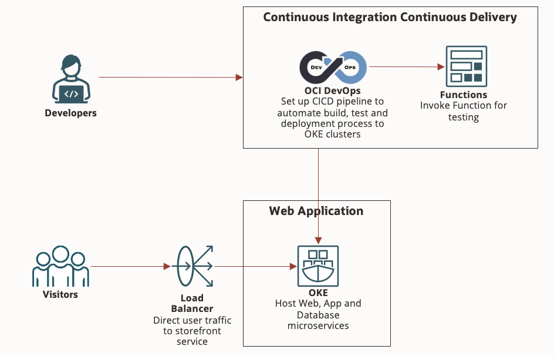

# Cloud Native Website on OCI Container Engine for Kubernetes (OKE)



This pattern shows how to deploy a cloud native website on Oracle Cloud Infrastructure (OCI) Container Engine for Kubernetes (OKE) via Continuos Integration and Continuos Deployment (CICD) pipeline using OCI DevOps service.

## **Overview:**

1) The website is built using **Nginx**, **PHP** and **MySQL** as microservices.
2) Nginx is exposed as a service of type Load Balancer and it's listening on TCP port 5000. PHP and MySQL will not be exposed for external connectivity to reduce external attack surface.
3) Upon code commit to "main" branch, build pipeline will be triggered automatically to build and test the applications.
4) Deployment pipeline will be triggered automatically once build pipeline runs successfully to deploy application to test OKE cluster, test it, and deploy it to production OKE cluster.

## **1. Deploy OKE Cluster**

OCI provides one-click cluster deployment and will take care of creation of VCN, subnets, security list, Kubernetes Master and Worker Nodes.

## **2. Set up OCI DevOps CICD Pipeline**

### a. Create Project
```
Steps Here
```
### b. Create Code Repository
```
Steps Here
```
### c. Create Artifacts
```
Steps Here
```
### d. Create Environment
```
Steps Here
```
### e. Create Deployment Pipeline
```
Steps Here
```
### f. Create Build Pipeline
```
Steps Here
```
### g. Create Trigger
```
Steps Here
```

## **3. Trigger CICD Pipeline** 
```
Steps Here
```

## **PHP to Autonamous Database Integration Steps**

1. After the Autonomous Database is created in the OCI web console, click "**DB Connection**" and download the Wallet.
2. You may replace the wallet .zip file with your wallet file in php-adb folder.
3. Change line 13 and 14 of the Dockerfile in php-adb folder to the name of your wallet file
```
ADD <wallet file name> /opt/oracle/<wallet file name> 
RUN cd /opt/oracle && unzip /opt/oracle/<wallet file name>
```
4. Create secret resource for Autonamous Database credentials.
* Create a new yaml file with the content below and give it a name. eg. secret-adb.yml 
```
apiVersion: v1
kind: Secret
metadata:
  name: adb-secret
type: Opaque
stringData:
  ADB_USER: <ADB username>
  ADB_PASSWORD: <ADB password>
  ADB_TNSNAME: <TNSNAME> #can be found in tnsnames.ora file located in the wallet file
  TNS_ADMIN: /opt/oracle/
```
* Apply this to the cloudnative-webapp-adb namespace
```
kubectl apply -f secret-adb.yml -n cloudnative-webapp-adb
```

5. Create new table in Autonomous Database using Oracle Database Action or any database client of your choice.

```
CREATE TABLE employee_data (
 id NUMBER GENERATED BY DEFAULT AS IDENTITY,
 first_name VARCHAR2(50) NOT NULL,
 last_name VARCHAR2(50) NOT NULL,
 gender VARCHAR2(50) NOT NULL,
 email VARCHAR2(50) NOT NULL,
 hire_date VARCHAR2(50) NOT NULL,
 department VARCHAR2(50) NOT NULL,
 job VARCHAR2(50) NOT NULL,
 salary NUMBER(10,2) NOT NULL,
 PRIMARY KEY(id)
);
```
6. Rebuild php container and deploy.